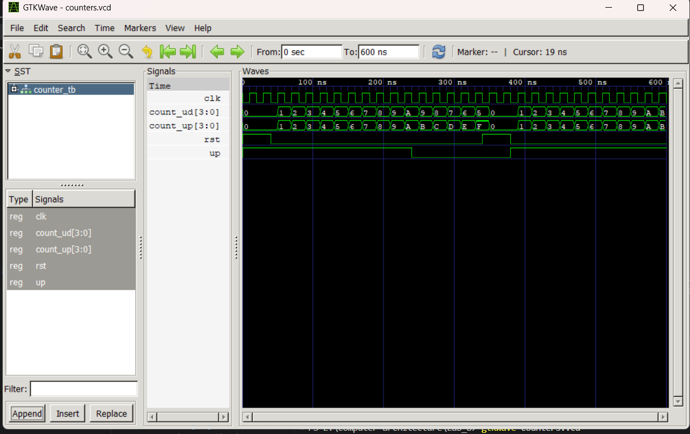

# Lab 8: VHDL Code for Sequential Circuits (4-Bit Counters)

---

## Objective

- To design and simulate a **4-bit Synchronous Up Counter** in VHDL.
- To design and simulate a **4-bit Synchronous Up/Down Counter** in VHDL.

---

## Theory

### 4-Bit Up Counter

A synchronous up counter increments its count by 1 on every rising edge of the clock. An active-high synchronous reset sets the count back to 0 when asserted.

| CLK (Rising Edge) | RST | COUNT     |
|-------------------|-----|-----------|
| ↑                 | 1   | 0000      |
| ↑                 | 0   | COUNT + 1 |

The counter wraps around from 1111 (15) back to 0000 (0).

### 4-Bit Up/Down Counter

An up/down counter increments or decrements on every rising clock edge based on the UP control signal. When UP = '1' the counter counts up; when UP = '0' it counts down. A synchronous reset returns the count to 0.

| CLK (Rising Edge) | RST | UP | COUNT     |
|-------------------|-----|----|-----------|
| ↑                 | 1   | X  | 0000      |
| ↑                 | 0   | 1  | COUNT + 1 |
| ↑                 | 0   | 0  | COUNT - 1 |

---

## Files Included

| File | Description |
|------|-------------|
| `counter_up.vhd` | VHDL implementation of the 4-bit Synchronous Up Counter |
| `counter_updown.vhd` | VHDL implementation of the 4-bit Synchronous Up/Down Counter |
| `counter_tb.vhd` | Testbench for both counters |
| `counters.vcd` | Value Change Dump output for counter simulation |
| `work-obj93.cf` | GHDL work library configuration file |

---

## Simulation

Simulation was performed using **GHDL** and waveforms were viewed in **GTKWave**.

### Commands Used

```bash
ghdl -a counter_up.vhd counter_updown.vhd counter_tb.vhd
ghdl -e COUNTER_TB
ghdl -r COUNTER_TB --vcd=counters.vcd
gtkwave counters.vcd
```

---

## Simulation Results

### Counter Waveform

The testbench uses a 20 ns clock period. Both counters are reset for the first 40 ns, then the up counter counts freely while the up/down counter direction is controlled by the UP signal.

| Time         | RST | UP | COUNT_UP      | COUNT_UD          |
|--------------|-----|----|---------------|-------------------|
| 0–40 ns      | 1   | 1  | 0             | 0 (reset)         |
| 40–240 ns    | 0   | 1  | 1 → 2 → … → A| 1 → 2 → … → A    |
| 240–340 ns   | 0   | 0  | B → C → … → F| 9 → 8 → … → 5    |
| 340–380 ns   | 1   | 0  | 0 (reset)     | 0 (reset)         |
| 380–580 ns   | 0   | 1  | 1 → 2 → … → A| 1 → 2 → … → A    |

- **COUNT_UP** always increments regardless of the UP signal, counting 0→1→2→…→F→0.
- **COUNT_UD** increments when UP = '1' and decrements when UP = '0', reaching a minimum of 5 (hex) before being reset.



---

## Conclusion

Both the 4-bit synchronous up counter and the 4-bit synchronous up/down counter were successfully designed in VHDL using a behavioral architecture with a clocked process. The active-high synchronous reset correctly initializes both counters to zero on the rising clock edge. Simulation results from GHDL and GTKWave confirm that the up counter increments continuously while the up/down counter correctly switches between increment and decrement modes based on the UP control signal.
